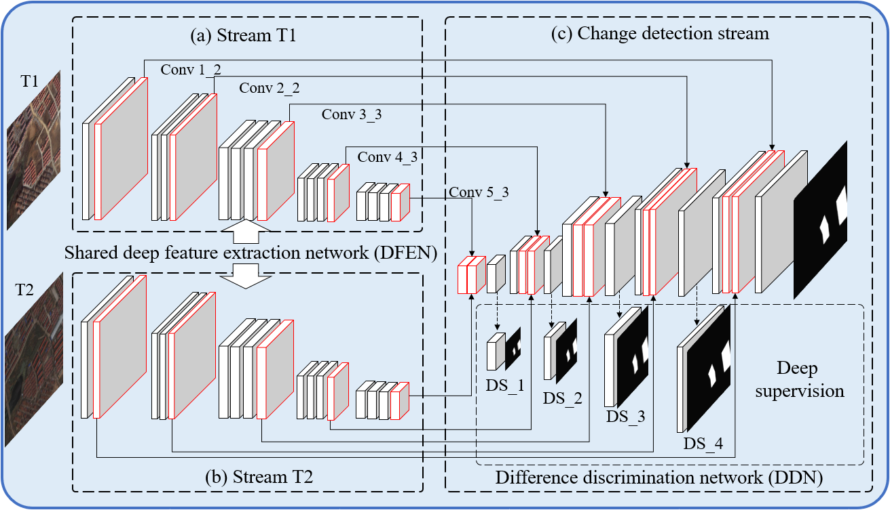

# A-deeply-supervised-image-fusion-network-for-change-detection-in-remote-sensing-images
Official implement of Paper：A deeply supervised image fusion network (DSIFN) for change detection in high resolution bi-temporal remote sening images

## Introduction
The codes are pytorch and keras implements for paper: A deeply supervised image fusion network for change detection in high resolution bi-temporal remote sening images

> [Zhang, C., Yue, P., Tapete, D., Jiang, L., Shangguan, B., Huang, L., & Liu, G. (2020). A deeply supervised image fusion network for change detection in high resolution bi-temporal remote sensing images. ISPRS Journal of Photogrammetry and Remote Sensing, 166, 183-200.](https://www.sciencedirect.com/science/article/abs/pii/S0924271620301532)

## Structure

The overview of Deeply supervised image fusion network (DSIFN). The network has two sub-networks: DFEN with pre-trained VGG16 as the backbone for deep feature extraction and DDN with deep feature fusion modules and deep supervision branches for change map reconstruction.

## Pytorch version requirements
- Python3.7
- PyTorch 1.6.0
- torchversion 0.7.0 

## Keras version requirements
- Python 3.6
- Tensorflow-gpu 1.13.1
- Keras 2.2.4
