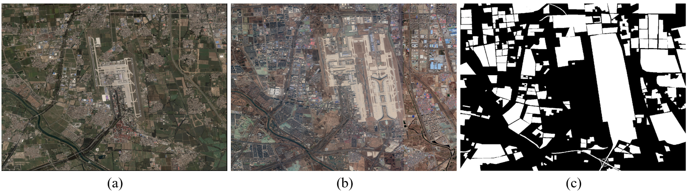
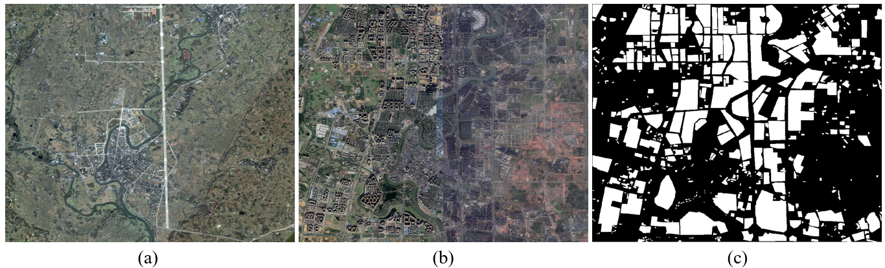
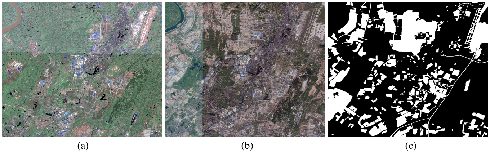
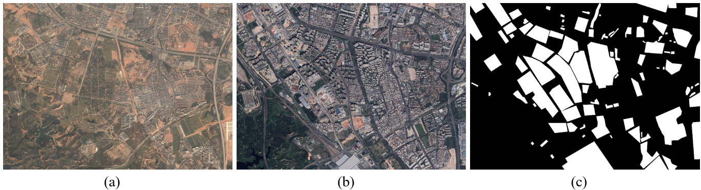
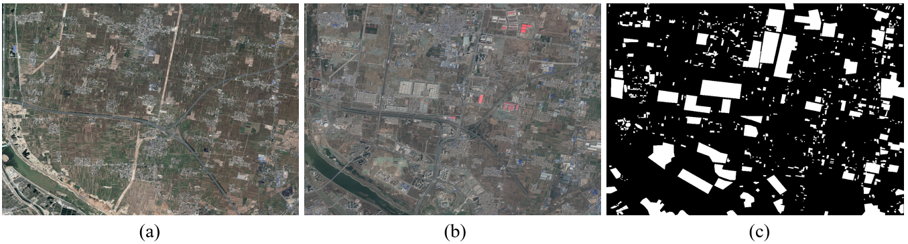

# DSIFN Dataset
 DSFIN 数据集

## Introduction
The dataset is manually collected from Google Earth. It consists of six large bi-temporal high resolution images covering six cities (i.e., Beijing, Chengdu, Shenzhen, Chongqing, Wuhan, Xian) in China. 

The five large image-pairs (i.e., Beijing, Chengdu, Shenzhen, Chongqing, Wuhan) are clipped into 394 subimage pairs with sizes of 512×512. After data augmentation, a collection of 3940 bi-temporal image pairs is acquired. Xian image pair is clipped into 48 image pairs for model testing. 

There are 3600 image pairs in the training dataset, 340 image paris in the validation dataset, and 48 image pairs in the test dataset.

> [Zhang, C., Yue, P., Tapete, D., Jiang, L., Shangguan, B., Huang, L., & Liu, G. (2020). A deeply supervised image fusion network for change detection in high resolution bi-temporal remote sensing images. ISPRS Journal of Photogrammetry and Remote Sensing, 166, 183-200.](https://www.sciencedirect.com/science/article/abs/pii/S0924271620301532) 

## Raw images

## Download link

-Download (Baidu Cloud): https://pan.baidu.com/s/19TRsdPiRym9DoV76DukQ5g 
-Password: hetu

## Note
please refer our paper if you use the data or code in your paper:
> [Zhang, C., Yue, P., Tapete, D., Jiang, L., Shangguan, B., Huang, L., & Liu, G. (2020). A deeply supervised image fusion network for change detection in high resolution bi-temporal remote sensing images. ISPRS Journal of Photogrammetry and Remote Sensing, 166, 183-200.](https://www.sciencedirect.com/science/article/abs/pii/S0924271620301532) 
