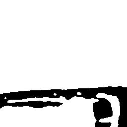
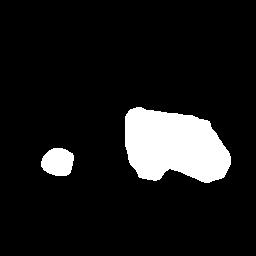
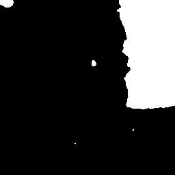

# DSIFN predicted results and model weights of the two datasets
 DSIFN 预测结果和模型权重文件

## Introduction

The predicted results & model weights files are provided in the below link. Note that the model weights files are in '.h5' format and are available only on the Keras version.

To load the model weights file:

-- from keras.models import load_model
-- model = load_model('best_model.h5', custom_objects={'bce_dice_loss': bce_dice_loss,'f1':f1})
-- results = model.predict(input_data)

## Download links

-Link: https://pan.baidu.com/s/1Ae6natlx2pA3ULfC56uMkg
-Password: nl1h

## Example of predicted images

